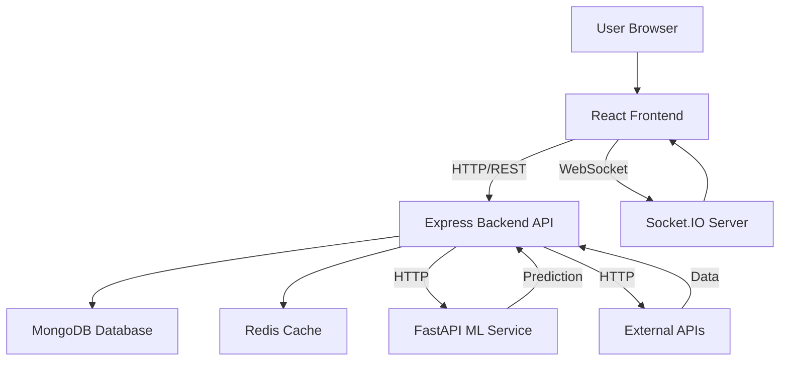

# AI Supply Chain Management System

A comprehensive, AI-powered supply chain management platform featuring real-time shipment tracking, predictive delay analysis, dynamic route optimization, and intelligent risk management.

## 🚀 Features

- **Real-Time Tracking**: Live shipment monitoring with Socket.IO-powered updates
- **AI-Powered Predictions**: Machine learning-based delay prediction using Gradient Boosting
- **Dynamic Route Optimization**: Automatic re-routing based on traffic, weather, and risk analysis
- **Cascade Prevention**: Intelligent corridor-based cascade failure prevention
- **AI Advisory**: Gemini AI integration for strategic logistics advice
- **Multi-API Integration**: OpenRoute, TomTom, OpenWeatherMap for comprehensive data
- **Risk Scoring**: Calibrated risk scores with probability-based alerts
- **Email Notifications**: HTML email alerts for high-risk shipments
- **Driver Dashboard**: Dedicated views for drivers and fleet managers
- **Redis Caching**: Multi-layer caching strategy for optimal performance

## 🏗️ Architecture


## 📄 Documentation

This project includes detailed documentation to help you understand the API and Technical Report.

### 📌 Available Docs

* 🔗 **Technical Report** – Comprehensive documentation covering the system architecture, design decisions, implementation details, technologies used, and overall project workflow.
  👉 [Technical Report](TECHNICAL_REPORT.md)

* 🔗 **API Documentation** – Complete reference for all API endpoints, request/response schemas, authentication, and usage examples.
  👉 [API Documentation](API_DOCUMENTATION.md)

## 🛠️ Tech Stack

### Frontend
- **Framework**: React 19.2.4 with Vite 8.0.1
- **Styling**: TailwindCSS 4.2.2
- **Maps**: MapLibre GL 5.22.0
- **Routing**: React Router 7.13.1
- **Real-time**: Socket.IO Client 4.8.3
- **HTTP**: Axios 1.13.6
- **Icons**: Lucide React 0.577.0

### Backend
- **Framework**: Express 5.2.1
- **Database**: MongoDB with Mongoose 9.3.1
- **Cache**: Redis with ioredis 5.10.1
- **Real-time**: Socket.IO 4.8.3
- **Authentication**: JWT 9.0.3 + bcryptjs 3.0.3
- **Rate Limiting**: Arcjet 1.3.0
- **Security**: Helmet 8.1.0
- **Validation**: Zod 4.3.6
- **Email**: Nodemailer 8.0.4
- **AI**: Google GenAI 1.46.0 (Gemini)

### ML Service
- **Framework**: FastAPI 0.135.1
- **Server**: Uvicorn 0.42.0
- **ML Library**: scikit-learn 1.8.0
- **Data**: pandas 3.0.1
- **Validation**: Pydantic 2.12.5
- **Model**: HistGradientBoostingRegressor

### External APIs
- **Routing**: OpenRoute Service, TomTom
- **Weather**: OpenWeatherMap
- **AI**: Google Gemini AI

## 📋 Prerequisites

- **Node.js**: v18.0.0 or higher
- **Python**: v3.9 or higher
- **MongoDB**: v4.4 or higher
- **Redis**: v6.0 or higher
- **npm**: v9.0.0 or higher
- **pip**: v23.0 or higher

## 🔧 Installation

### 1. Clone the Repository

```bash
git clone https://github.com/shubharoydev/AI_supply_chain_management_system.git
cd AI_supply_chain_management_system
```

### 2. Backend Setup

```bash
cd backend

# Install dependencies
npm install

# Create environment file
cp .env.example .env

# Configure environment variables
# Edit .env with your configuration
```

**Required Environment Variables (backend/.env):**

```env
PORT=5000
MONGO_URI=mongodb://localhost:27017/smart-supply
REDIS_URL=redis://127.0.0.1:6379
JWT_SECRET=your-secret-key-here
ML_SERVICE_URL=http://localhost:8000
ML_API_KEY=your-ml-api-key
NODE_ENV=development

ARCJET_KEY=your-arcjet-key
ARCJET_ENV=development

RISK_SCORE_THRESHOLD=70
DELAY_PROBABILITY_THRESHOLD=0.7
SIMULATION_INTERVAL_MS=3000

OPENROUTE_API_KEY=your-openroute-key
OPENROUTE_BASE_URL=https://api.openrouteservice.org

WEATHER_API_KEY=your-openweather-key
WEATHER_BASE_URL=https://api.openweathermap.org/data/2.5

TRAFFIC_API_KEY=your-tomtom-key
TRAFFIC_BASE_URL=https://api.tomtom.com

GEMINI_API_KEY=your-gemini-key

EMAIL_USER=your-email@gmail.com
EMAIL_PASS=your-app-password
```

### 3. ML Service Setup

```bash
cd ML_Model

# Install dependencies
pip install -r requirements.txt

# Create environment file
cp .env.example .env

# Configure environment variables
# Edit .env with your configuration
```

**Required Environment Variables (ML_Model/.env):**

```env
PORT=8000
API_KEY=your-api-key
ENV=development
MODEL_PATH=./models/saved_model/model.joblib
SCALER_PATH=./models/saved_model/scaler.joblib
```

### 4. Frontend Setup

```bash
cd frontend

# Install dependencies
npm install

# Create environment file
cp .env.example .env

# Configure environment variables
# Edit .env with your configuration
```

**Required Environment Variables (frontend/.env):**

```env
VITE_ORS_API_KEY=your-openroute-key
VITE_BACKEND_URL=http://localhost:5000
VITE_SOCKET_URL=ws://localhost:5000
```

## 🚀 Running the Application

### Start ML Service

```bash
cd ML_Model
python main.py
```

The ML service will start on `http://localhost:8000`

### Start Backend

```bash
cd backend
npm run dev
```

The backend will start on `http://localhost:5000`

### Start Frontend

```bash
cd frontend
npm run dev
```

The frontend will start on `http://localhost:5173`


## ⚙️ Configuration

### Backend Configuration

Key configuration options in `backend/config/env.js`:

- `RISK_SCORE_THRESHOLD`: Risk score threshold for alerts (default: 70)
- `DELAY_PROBABILITY_THRESHOLD`: Delay probability threshold (default: 0.7)
- `SIMULATION_INTERVAL_MS`: Simulation tick interval (default: 3000ms)
- `REROUTE_SWITCH_LOOKAHEAD_POINTS`: Route switch lookahead (default: 4)

### ML Model Configuration

The ML model uses HistGradientBoostingRegressor with the following hyperparameters:

- `max_iter`: 420
- `learning_rate`: 0.06
- `max_depth`: 12
- `min_samples_leaf`: 18
- `l2_regularization`: 0.12

### Frontend Configuration

Frontend configuration is handled via environment variables in `.env`:

- `VITE_BACKEND_URL`: Backend API URL
- `VITE_SOCKET_URL`: WebSocket server URL
- `VITE_ORS_API_KEY`: OpenRoute API key for maps


## 🤝 Contributing

Contributions are welcome! Please follow these guidelines:

1. Fork the repository
2. Create a feature branch (`git checkout -b feature/amazing-feature`)
3. Commit your changes (`git commit -m 'Add amazing feature'`)
4. Push to the branch (`git push origin feature/amazing-feature`)
5. Open a Pull Request


## 🙏 Acknowledgements

- **OpenRoute Service** - Routing and geocoding APIs
- **TomTom** - Traffic data and routing
- **OpenWeatherMap** - Weather data
- **Google Gemini AI** - AI advisory capabilities
- **MapLibre GL** - Map rendering
- **Socket.IO** - Real-time communication
---
**Note**: This project is currently in development/prototype stage. See the [Technical Report](TECHNICAL_REPORT.md) and [API Documentation](API_DOCUMENTATION.md)for a comprehensive analysis of the codebase, architecture
                                                                                                          