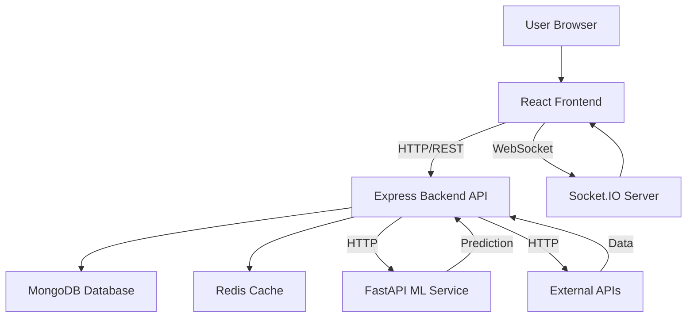
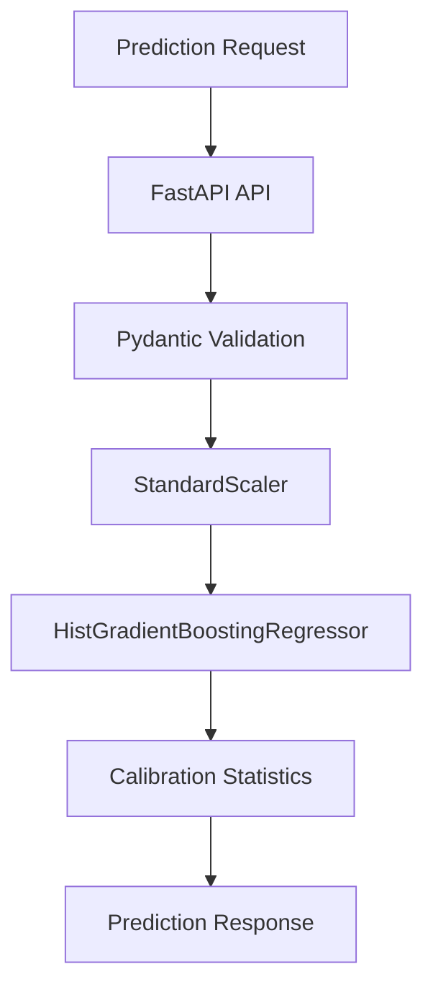

# AI Supply Chain Management System - Technical Report

## Executive Summary

The AI Supply Chain Management System is a sophisticated full-stack application designed for real-time logistics optimization, AI-powered delay prediction, and dynamic route re-routing. The system employs a microservices architecture with separate frontend, backend, and ML prediction services, integrated with multiple external APIs for routing, traffic, weather, and AI advisory capabilities.

**Key Metrics:**
- **Architecture:** Microservices (3-tier)
- **Frontend:** React 19 + Vite 8 + MapLibre GL
- **Backend:** Express 5 + MongoDB + Redis + Socket.IO
- **ML Service:** FastAPI + scikit-learn (HistGradientBoostingRegressor)
- **External APIs:** 5+ integrations (OpenRoute, TomTom, OpenWeatherMap, Gemini AI, Nodemailer)
- **Real-time:** Socket.IO with Redis-backed state management
- **Maturity Level:** Development/Prototype
- **Deployment Status:** Local development (no production deployment config found)

---

## Repository Overview

### Purpose and Target Users

**Purpose:** Provide an intelligent, AI-driven supply chain management platform that enables real-time shipment tracking, predictive delay analysis, and automated route optimization to minimize logistics costs and improve delivery reliability.

**Target Users:**
- Logistics managers and dispatchers
- Supply chain operations teams
- Fleet managers
- Drivers (via driver dashboard)

**Problem Solved:**
- Lack of real-time visibility into shipment status
- Inability to predict delays before they occur
- Manual route optimization processes
- Reactive rather than proactive risk management
- No cascading failure prevention for corridor routes

---

## Technology Stack

| Layer | Technology | Version | Purpose |
|-------|-----------|---------|---------|
| **Frontend Framework** | React | 19.2.4 | UI framework |
| **Frontend Build Tool** | Vite | 8.0.1 | Build tool and dev server |
| **Styling** | TailwindCSS | 4.2.2 | Utility-first CSS framework |
| **Maps** | MapLibre GL | 5.22.0 | Map rendering and visualization |
| **Routing** | React Router | 7.13.1 | Client-side routing |
| **State Management** | React Context | - | Global state (user auth) |
| **Real-time Client** | Socket.IO Client | 4.8.3 | WebSocket client |
| **HTTP Client** | Axios | 1.13.6 | API requests |
| **Icons** | Lucide React | 0.577.0 | Icon library |
| **Backend Framework** | Express | 5.2.1 | Web framework |
| **Database** | MongoDB | - | Primary data store |
| **ORM** | Mongoose | 9.3.1 | MongoDB ODM |
| **Cache** | Redis | - | Caching and session store |
| **Redis Client** | ioredis | 5.10.1 | Redis client for Node.js |
| **Real-time Server** | Socket.IO | 4.8.3 | WebSocket server |
| **Authentication** | JWT | 9.0.3 | Token-based auth |
| **Password Hashing** | bcryptjs | 3.0.3 | Password hashing |
| **Rate Limiting** | Arcjet | 1.3.0 | API rate limiting |
| **Security Headers** | Helmet | 8.1.0 | Security middleware |
| **Validation** | Zod | 4.3.6 | Schema validation |
| **Email** | Nodemailer | 8.0.4 | Email sending |
| **ML Framework** | FastAPI | 0.135.1 | ML API framework |
| **ML Server** | Uvicorn | 0.42.0 | ASGI server |
| **ML Library** | scikit-learn | 1.8.0 | ML algorithms |
| **Model Serialization** | joblib | 1.5.3 | Model persistence |
| **Data Processing** | pandas | 3.0.1 | Data manipulation |
| **Schema Validation** | Pydantic | 2.12.5 | Data validation |
| **AI Service** | Google GenAI | 1.46.0 | Gemini AI integration |
| **Routing API** | OpenRoute Service | - | Route optimization |
| **Traffic API** | TomTom | - | Traffic data |
| **Weather API** | OpenWeatherMap | - | Weather data |
| **Package Manager (Frontend)** | npm | - | Dependency management |
| **Package Manager (Backend)** | npm | - | Dependency management |
| **Package Manager (ML)** | pip | - | Python dependencies |
---

## Architecture Analysis

### System Architecture Diagram



### Request Lifecycle

1. **Authentication Flow:**
   - User submits credentials to `/api/auth/login`
   - Backend validates against MongoDB
   - JWT access token (15min expiry) and refresh token (7 days) generated
   - Refresh token stored in Redis with device fingerprinting
   - Access token returned to frontend
   - Frontend stores tokens in localStorage
   - Subsequent requests include Bearer token
   - Middleware validates JWT on protected routes
   - Automatic token refresh on 401 errors via axios interceptor

2. **Shipment Creation Flow:**
   - User submits shipment details via form
   - POST to `/api/deliveries` with authentication
   - Backend validates input with Zod
   - Historical delay baseline calculated from MongoDB aggregation
   - Route waypoints geocoded using external geocoding service
   - Optimized route computed via OpenRoute/TomTom APIs
   - Delivery document created in MongoDB
   - Route state cached in Redis (7-day TTL)
   - Response returned with optimized route

3. **Simulation and Real-time Tracking Flow:**
   - User clicks "Start Delivery" on shipment
   - POST to `/api/deliveries/:id/start`
   - Backend updates status to 'in-transit' in Redis
   - Socket.IO emits 'delivery-started' event
   - Simulation loop started (configurable interval, default 3s)
   - Each tick:
     - Fetches current traffic/weather from APIs
     - Builds ML prediction payload
     - Calls ML service for delay prediction
     - Updates risk score and status if threshold exceeded
     - Triggers route re-optimization if high risk
     - Updates current location along route
     - Emits 'location-update' via Socket.IO
     - Persists state to Redis
   - Frontend receives Socket.IO events and updates UI
   - Map markers animate along route in real-time

4. **ML Prediction Flow:**
   - Backend builds prediction payload (distance, traffic, weather, historical_delay)
   - POST to ML service `/predict` with API key
   - ML service validates input with Pydantic
   - Features scaled using StandardScaler
   - HistGradientBoostingRegressor predicts delay minutes
   - Risk score calculated using calibration statistics
   - Delay probability computed using sigmoid function
   - Response returned with probability, minutes, and risk score
   - Backend applies risk smoothing to prevent volatility
   - Fallback heuristic used if ML service unavailable

---

## Frontend Analysis

### State Management

**UserContext:**
- Manages user authentication state
- Stores access token and refresh token
- Handles automatic token refresh via axios interceptor
- Provides login/logout functions

**Local Component State:**
- Dashboard: shipments list, loading states, live banners, operations log
- AIAdvisor: briefing text, chat log, question input
- CreateShipmentForm: form data, loading, notices
- LiveMap: popup info, map bounds

### API Communication

**Base URL:** Configured via `VITE_BACKEND_URL` environment variable  
**HTTP Client:** Axios with interceptors for token refresh  
**Authentication:** Bearer token in Authorization header

**Key API Calls:**
- `GET /api/deliveries` - Fetch all shipments
- `POST /api/deliveries` - Create new shipment
- `POST /api/deliveries/:id/start` - Start delivery simulation
- `POST /api/deliveries/:id/stop` - Stop simulation
- `DELETE /api/deliveries/:id` - Delete shipment
- `GET /api/advisory/briefing` - Get AI briefing
- `POST /api/advisory/ask` - Ask AI question
- `POST /api/auth/login` - User login
- `POST /api/auth/register` - User registration
- `POST /api/auth/refresh` - Refresh access token
- `POST /api/auth/logout` - User logout

### Socket.IO Integration

**Socket Client:** Custom hook `useSocket.js`  
**Connection:** Auto-connects on mount  
**Events Listened:**
- `location-update` - Real-time location updates
- `route-updated` - Route re-optimization events
- `delay-alert` - High-risk alerts
- `delivery-started` - Delivery started
- `delivery-completed` - Delivery finished
- `cascade-mitigation` - Cascading failure prevention
- `ai-advisory` - AI advisor messages

**Optimizations Implemented:**
- React.memo for component memoization (limited use)
- useMemo for expensive computations (KPI calculations, route bounds)
- useCallback for function memoization
- Socket.IO for real-time updates (reduces polling)
- Redis caching on backend (reduces API calls)
- Route subsampling to limit map points (max 72 points)
- ML state caching (2-minute TTL) to reduce API calls

**Potential Improvements:**
- Code splitting for route-based lazy loading
- Virtual scrolling for large shipment lists
- Image optimization for map markers
- Service worker for offline support
- Bundle size analysis and optimization

### Error Handling

**Frontend Error Handling:**
- Try-catch blocks in async functions
- User-friendly error messages in UI
- Alert banners for notifications
- Fallback to simulated data when APIs fail
- Automatic token refresh on 401 errors

**Backend Error Handling:**
- Global error middleware
- Custom error classes with status codes
- Validation middleware with Zod
- Graceful degradation when external APIs fail
- Fallback ML prediction when service unavailable

### Security

**Security Measures:**
- JWT authentication with short-lived access tokens
- Refresh token rotation with Redis storage
- Device fingerprinting for refresh tokens
- HTTPS enforcement in production (via Vercel)
- CORS configuration on backend
- Helmet security headers
- Arcjet rate limiting
- Input validation with Zod
- SQL injection prevention (MongoDB ORM)
- XSS prevention (React escaping)

---

## Backend Analysis


### Controllers

**auth.controller.js:**
- `register` - User registration with password hashing
- `login` - User authentication with token generation
- `refreshToken` - Access token refresh
- `logout` - Token invalidation
- `getMe` - Current user profile

**delivery.controller.js:**
- `createShipment` - Create new delivery with route optimization
- `getShipments` - Fetch all shipments with Redis state injection
- `getShipmentById` - Fetch single shipment
- `startDelivery` - Start simulation loop
- `stopShipment` - Stop simulation
- `deleteShipment` - Delete shipment
- `getShipmentByTruckId` - Driver endpoint for truck lookup

**advisory.controller.js:**
- `getBriefing` - Generate AI network briefing
- `askAdvisor` - Process user questions with AI

### Services

**Core Services:**
1. **ml.service.js** - ML prediction with risk smoothing
2. **optimization.service.js** - Route re-optimization and risk handling
3. **simulation.service.js** - Real-time delivery simulation
4. **cascading.service.js** - Cascade failure prevention
5. **route.service.js** - Route building and re-routing
6. **traffic.service.js** - TomTom traffic API integration
7. **weather.service.js** - OpenWeatherMap API integration
8. **gemini.service.js** - Gemini AI integration
9. **email.service.js** - Email notifications with HTML templates
10. **openroute.service.js** - OpenRoute API integration
11. **delivery.service.js** - Delivery operations
12. **mlFeatures.service.js** - ML feature engineering
13. **socket.service.js** - Socket utilities
14. **socketsDb.service.js** - Socket event persistence to SQLite

### Middleware

**auth.middleware.js:**
- `authenticate` - JWT token verification
- `authorize` - Role-based authorization (unused)

**rateLimit.middleware.js:**
- `arcjetRateLimiter` - Arcjet-based rate limiting with token bucket algorithm
- Configurable tokens per request
- Rate limit headers in response

**Other Middleware:**
- `error.middleware.js` - Global error handling
- `geminiRateLimit.middleware.js` - AI-specific rate limiting
- `logger.middleware.js` - Request/response logging
- `validation.middleware.js` - Zod schema validation

### API Endpoints Documentation

#### Authentication Endpoints

**POST /api/auth/register**
- Purpose: Register new user
- Authentication: None
- Request Body:
  ```json
  {
    "username": "string",
    "email": "string",
    "password": "string",
    "role": "manager|admin|driver"
  }
  ```
- Response: User object (without password)
- Status Codes: 201 (created), 400 (validation error), 409 (duplicate)

**POST /api/auth/login**
- Purpose: User login
- Authentication: None
- Request Body:
  ```json
  {
    "username": "string",
    "password": "string"
  }
  ```
- Response:
  ```json
  {
    "accessToken": "string",
    "refreshToken": "string",
    "user": {
      "id": "string",
      "username": "string",
      "role": "string"
    }
  }
  ```
- Status Codes: 200 (success), 401 (invalid credentials)

**POST /api/auth/refresh**
- Purpose: Refresh access token
- Authentication: None (uses refresh token)
- Request Body:
  ```json
  {
    "refreshToken": "string"
  }
  ```
- Response:
  ```json
  {
    "accessToken": "string"
  }
  ```
- Status Codes: 200 (success), 401 (invalid/expired token)

**POST /api/auth/logout**
- Purpose: Invalidate refresh token
- Authentication: None (uses refresh token)
- Request Body:
  ```json
  {
    "refreshToken": "string"
  }
  ```
- Response: Success message
- Status Codes: 200 (success)

**GET /api/auth/me**
- Purpose: Get current user profile
- Authentication: Required (Bearer token)
- Response: User object
- Status Codes: 200 (success), 401 (unauthorized), 404 (not found)

#### Delivery Endpoints

**GET /api/deliveries**
- Purpose: Fetch all shipments
- Authentication: Required
- Response: Array of delivery objects with Redis state injection
- Status Codes: 200 (success), 401 (unauthorized), 500 (server error)

**GET /api/deliveries/:id**
- Purpose: Fetch single shipment
- Authentication: Required
- Response: Delivery object with Redis state injection
- Status Codes: 200 (success), 400 (invalid ID), 404 (not found), 401 (unauthorized)

**POST /api/deliveries**
- Purpose: Create new shipment
- Authentication: Required
- Rate Limit: 1 token
- Request Body:
  ```json
  {
    "origin": "string",
    "destinations": ["string"],
    "truckId": "string",
    "cargoType": "general|essential|pharma",
    "cargoValue": "number"
  }
  ```
- Response: Created delivery with optimized route
- Status Codes: 201 (created), 400 (validation error), 409 (duplicate), 500 (server error)

**POST /api/deliveries/:id/start**
- Purpose: Start delivery simulation
- Authentication: Required
- Rate Limit: 1 token
- Response: Success message with delivery state
- Status Codes: 200 (success), 404 (not found), 400 (already delivered)

**POST /api/deliveries/:id/stop**
- Purpose: Stop delivery simulation
- Authentication: Required
- Rate Limit: 1 token
- Response: Success message
- Status Codes: 200 (success), 404 (not found)

**DELETE /api/deliveries/:id**
- Purpose: Delete shipment
- Authentication: Required
- Rate Limit: 1 token
- Response: 204 (no content)
- Status Codes: 204 (success), 404 (not found), 500 (server error)

**POST /api/deliveries/driver/truck**
- Purpose: Driver endpoint to get shipment by truck ID
- Authentication: Required
- Rate Limit: 1 token
- Request Body:
  ```json
  {
    "truckId": "string"
  }
  ```
- Response: Delivery object
- Status Codes: 200 (success), 400 (missing truckId), 404 (not found)

**POST /api/deliveries/predict**
- Purpose: Manual ML prediction endpoint
- Authentication: None
- Rate Limit: 10 tokens
- Request Body:
  ```json
  {
    "distance": "number",
    "traffic": "number",
    "weather": "number",
    "historical_delay": "number"
  }
  ```
- Response: ML prediction result
- Status Codes: 200 (success), 429 (rate limited)

#### Advisory Endpoints

**GET /api/advisory/briefing**
- Purpose: Generate AI network briefing
- Authentication: Required
- Rate Limit: Gemini-specific
- Response:
  ```json
  {
    "briefing": "string (markdown)"
  }
  ```
- Status Codes: 200 (success), 401 (unauthorized), 500 (server error)

**POST /api/advisory/ask**
- Purpose: Ask AI advisor a question
- Authentication: Required
- Rate Limit: Gemini-specific
- Request Body:
  ```json
  {
    "question": "string"
  }
  ```
- Response:
  ```json
  {
    "answer": "string"
  }
  ```
- Status Codes: 200 (success), 400 (missing question), 401 (unauthorized), 500 (server error)

### Database Schema

**Delivery Model (MongoDB):**
```javascript
{
  origin: String (required, indexed),
  destinations: [String],
  routeHash: String (indexed, auto-generated),
  optimizedRoute: [{ lat: Number, lng: Number }],
  currentLocation: { lat: Number, lng: Number },
  routeProgressIndex: Number (default: 0),
  status: Enum['pending', 'in-transit', 'at-risk', 'delayed', 'delivered'],
  ETA: Date,
  delayPrediction: {
    probability: Number,
    minutes: Number,
    historicalBaseline: Number,
    riskBreakdown: Object,
    trafficDesc: String,
    weatherDesc: String,
    weatherTemp: Number
  },
  historicalDelayBaseline: Number (default: 40),
  riskScore: Number (default: 0, indexed),
  truckId: String (required, indexed),
  cargoType: Enum['general', 'essential', 'pharma'],
  cargoValue: Number (default: 50000),
  simulationTick: Number (default: 0),
  cascadeMitigated: Boolean (default: false),
  activeObstacles: [String],
  createdBy: ObjectId (ref: User, indexed),
  originalRoute: [{ lat: Number, lng: Number }],
  rerouteRoute: [{ lat: Number, lng: Number }],
  rerouteSwitchIndex: Number,
  rerouteIsApplied: Boolean,
  lastReroutedAt: Date,
  lastTraffic: Number,
  lastWeather: Number,
  timestamps: { createdAt: Date, updatedAt: Date }
}
```

**User Model (MongoDB):**
```javascript
{
  username: String (required, unique),
  email: String (required, unique, lowercase, trimmed),
  password: String (required, hashed),
  role: Enum['admin', 'manager', 'driver'] (default: manager),
  timestamps: { createdAt: Date, updatedAt: Date }
}
```

**Indexes:**
- Delivery: origin, status, riskScore, truckId, cargoType, createdBy, routeHash
- Composite: status + riskScore, routeHash + status
- User: username, email

### Redis Cache Structure

**Cache Keys:**
- `sim:{deliveryId}:state` - Simulation state (7-day TTL)
- `cache:ml_state:{deliveryId}` - ML prediction cache (2-minute TTL)
- `cache:traffic:{routeKey}` - Traffic data cache (5-minute TTL)
- `cache:weather:{lat,lng}` - Weather data cache (30-minute TTL)
- `cache:route:tomtom:{routeKey}` - TomTom route cache (5-minute TTL)
- `cooldown:reroute:{deliveryId}` - Re-route cooldown (5-minute TTL)
- `cooldown:alert:{deliveryId}` - Alert cooldown (1-minute TTL)
- `refresh_token:{userId}:{deviceId}` - Refresh token (7-day TTL)
- `refresh_token_rev:{refreshToken}` - Refresh token reverse mapping (7-day TTL)
- `demo:delivery:{deliveryId}:force_high_risk` - Demo risk forcing
- `demo:force_high_risk` - Global demo risk forcing

### Socket.IO Events

**Server → Client:**
- `delivery-started` - Delivery simulation started
- `delivery-stopped` - Delivery simulation stopped
- `delivery-completed` - Delivery finished
- `delivery-deleted` - Delivery deleted
- `location-update` - Real-time location update
- `route-updated` - Route re-optimized
- `delay-alert` - High-risk alert
- `cascade-mitigation` - Cascade prevention triggered
- `ai-advisory` - AI advisor message

**Client → Server:**
- `subscribe-delivery` - Subscribe to delivery updates

### Background Jobs

**Simulation Loop:**
- Runs every 3 seconds (configurable via `SIMULATION_INTERVAL_MS`)
- Managed via `setInterval` with Map-based tracking
- Each delivery has independent simulation loop
- Stops when delivery completed or manually stopped

**Cache Cleanup:**
- Traffic cache cleanup every 2 minutes
- Weather cache cleanup every 5 minutes

---

## Machine Learning Analysis

### Problem Type

**Primary Task:** Regression (delay prediction in minutes)  
**Secondary Tasks:** Binary classification (delay probability), Risk scoring (0-100)  
**Domain:** Logistics/Supply Chain optimization

### Dataset

**Training Data Sources:**
- `clean_porter_data.csv` - 28,278 rows (porter delivery data)
- `enhanced_training_data.csv` - 179,263 rows (synthetic enhanced data)
- `GlobalWeatherRepository.csv` - 130,783 rows (weather data - referenced but not directly used)

**Combined Dataset:** 355,040 rows after cleaning  
**Features:**
- distance (km)
- traffic (0-100 congestion index)
- weather (0-100 severity index)
- historical_delay (minutes)

**Target:**
- delay_minutes (continuous)

### Data Preprocessing

**Steps:**
1. Data loading from CSV files
2. Concatenation of multiple datasets
3. Missing value removal (dropna)
4. Value filtering (distance >= 0, delay_minutes >= 0)
5. Delay clipping (0-240 minutes)
6. Train/test split (85/15)
7. Feature scaling using StandardScaler

### Feature Engineering

**ML Features (mlFeatures.service.js):**
- Distance from origin to destination
- Traffic congestion factor (from TomTom API or simulation)
- Weather severity factor (from OpenWeatherMap API or simulation)
- Historical delay baseline (from MongoDB aggregation)
- Time-based factors (rush hour multipliers)

**Risk Breakdown:**
- Traffic percentage contribution
- Weather percentage contribution
- Operations/historical percentage contribution

### Model Architecture

**Algorithm:** HistGradientBoostingRegressor (scikit-learn)  
**Why Chosen:**
- Strong nonlinear fits on tabular data
- Native handling of large datasets (100k+ rows)
- Lower memory usage vs classic GBR
- Less hyperparameter sensitivity than deep learning
- Good performance on structured logistics features

**Hyperparameters:**
```python
max_iter=420
learning_rate=0.06
max_depth=12
min_samples_leaf=18
l2_regularization=0.12
early_stopping=True
validation_fraction=0.12
n_iter_no_change=25
random_state=42
```

### Training Pipeline

**Process:**
1. Load and combine datasets
2. Clean and filter data
3. Split features (X) and target (y)
4. Train/test split (85/15)
5. Scale features using StandardScaler
6. Train HistGradientBoostingRegressor
7. Save model, scaler, and training statistics
8. Calculate evaluation metrics

**Training Statistics:**
- y_mean: 46.20 minutes
- y_std: 9.46 minutes
- y_p75: 52.0 minutes
- y_p90: 59.0 minutes
- n_samples: 355,040

### Validation and Testing

**Metrics:**
- MAE (Mean Absolute Error): 5.08 minutes
- RMSE (Root Mean Squared Error): 6.73 minutes
- R² (R-Squared): 0.493
- Accuracy within 10 minutes: 87.8%
- Accuracy within 5 minutes: 59.6%

**Interpretation:**
- Moderate R² (0.493) indicates model explains ~49% of variance
- Good accuracy for business use (87.8% within 10 minutes)
- Room for improvement with additional features

### Loss Functions and Optimizers

**Loss Function:** Squared error (default for HistGradientBoostingRegressor)  
**Optimizer:** Gradient boosting with early stopping  
**Regularization:** L2 regularization (0.12)

### Inference Pipeline

**Process:**
1. Receive prediction request via FastAPI
2. Validate input with Pydantic
3. Scale features using loaded StandardScaler
4. Predict delay minutes using loaded model
5. Calculate delay probability using sigmoid function
6. Calculate risk score using calibrated statistics
7. Return prediction with confidence metrics

**Input Schema:**
```python
{
  distance: float (>= 0)
  traffic: float (0-100)
  weather: float (0-100)
  historical_delay: float (>= 0)
}
```

**Output Schema:**
```python
{
  delay_probability: float (0-1)
  expected_delay_minutes: float (>= 0)
  risk_score: int (0-100)
}
```

### Model Deployment

**Framework:** FastAPI with Uvicorn  
**Serving:** HTTP REST API  
**Workers:** 1 in development, 2 in production  
**Port:** 8000 (configurable)  
**Authentication:** API key via X-API-Key header  
**Documentation:** Auto-generated OpenAPI docs (/docs in dev)

### GPU/CPU Support

**Current:** CPU-only (scikit-learn)  
**GPU:** Not utilized (scikit-learn is CPU-optimized)  
**CPU:** Multi-core support via joblib

### Scalability

**Current:** Single-instance deployment  
**Horizontal Scaling:** Possible via load balancer  
**Caching:** Backend implements risk smoothing and ML state caching  
**Rate Limiting:** Backend implements Arcjet rate limiting

### ML Architecture Diagram



---

## Security Audit

### Authentication

**Implementation:** JWT with access/refresh token pattern  
- Short-lived access tokens (15 minutes)
- Refresh token rotation
- Device fingerprinting
- Redis-based token storage
- Password hashing with bcrypt (salt rounds: 10)


### Authorization

**Implementation:** Role-based access control (RBAC)  
**Roles:** admin, manager, driver  
- Role-based middleware available
- User role stored in JWT payload


---

## Performance Audit

### Frontend Performance

**Optimizations:**
- React.memo for component memoization
- useMemo for expensive computations
- useCallback for function memoization
- Code splitting via Vite (automatic)
- Socket.IO reduces polling overhead

### Backend Performance

**Optimizations:**
- Redis caching for hot data
- Database indexes on frequently queried fields
- Async/await for non-blocking I/O
- Connection pooling (default MongoDB)
- ML state caching (2-minute TTL)
- Risk smoothing to reduce ML calls


### Database Performance

**Optimizations:**
- Compound indexes on frequently queried fields
- Redis caching for hot data
- Projection in queries

### ML Inference Performance

**Optimizations:**
- Model loaded once at startup
- Feature scaling cached
- ML state caching (2-minute TTL)
- Risk smoothing reduces ML calls


### Caching Strategy

**Current Implementation:**
- Redis for simulation state (7-day TTL)
- Redis for ML predictions (2-minute TTL)
- Redis for traffic data (5-minute TTL)
- Redis for weather data (30-minute TTL)
- Redis for route caching (5-minute TTL)
- In-memory cache for route data

---

## Feature Inventory

| Feature | Status | Files | Description |
|---------|--------|-------|-------------|
| User Authentication | Implemented | auth.controller.js, UserContext.jsx | JWT-based auth with refresh tokens |
| User Registration | Implemented | auth.controller.js, Signup.jsx | User registration with validation |
| Shipment Creation | Implemented | delivery.controller.js, CreateShipmentForm.jsx | Create shipments with route optimization |
| Route Optimization | Implemented | optimization.service.js, route.service.js | Multi-API route optimization with fallbacks |
| Real-time Tracking | Implemented | simulation.service.js, LiveMap.jsx | Socket.IO-based real-time location updates |
| ML Delay Prediction | Implemented | ml.service.js, delay_predictor.py | Gradient boosting regression for delay prediction |
| Risk Scoring | Implemented | ml.service.js, delay_predictor.py | Calibrated risk scoring based on ML predictions |
| Dynamic Re-routing | Implemented | optimization.service.js | Automatic route re-optimization on high risk |
| Cascade Prevention | Implemented | cascading.service.js | Corridor-based cascade failure prevention |
| AI Advisory | Implemented | gemini.service.js, AIAdvisor.jsx | Gemini AI for strategic advice |
| Email Alerts | Implemented | email.service.js | HTML email alerts for high-risk shipments |
| Traffic Integration | Implemented | traffic.service.js | TomTom traffic API with fallback |
| Weather Integration | Implemented | weather.service.js | OpenWeatherMap API with fallback |
| Driver Dashboard | Implemented | DriverDashboard.jsx, DriverTruckEntry.jsx | Driver-specific views |
| Rate Limiting | Implemented | rateLimit.middleware.js | Arcjet-based rate limiting |
| Request Logging | Implemented | logger.middleware.js | Winston-based request logging |
| Security Headers | Implemented | server.js (Helmet) | Security headers via Helmet |
| Input Validation | Implemented | validation.middleware.js | Zod-based validation |
| Redis Caching | Implemented | Multiple services | Multi-layer caching strategy |
| Socket.IO Events | Implemented | sockets/index.js | Real-time event system |
| Demo Mode | Implemented | simulation.service.js, demo-force-risk.js | Demo risk forcing for testing |

---


## Conclusion

The AI Supply Chain Management System is a well-architected and feature-rich application that demonstrates strong technical capabilities in real-time logistics optimization, AI-powered predictions, and dynamic route re-routing. The system employs modern technologies and follows good software engineering practices in many areas.

**Key Strengths:**
- Clean microservices architecture
- Modern tech stack (React 19, Express 5, FastAPI)
- Comprehensive feature set with AI integration
- Good separation of concerns
- Effective caching strategy
- Real-time capabilities via Socket.IO
- Multiple API integrations with fallbacks


**Overall Assessment:**
This is a promising prototype with solid architectural foundations and innovative features. The codebase demonstrates good engineering practices and modern development patterns. However, significant work is needed in testing, DevOps, security, and documentation to make it production-ready. The system would benefit from a structured improvement roadmap focusing on the critical blockers identified in this report.
